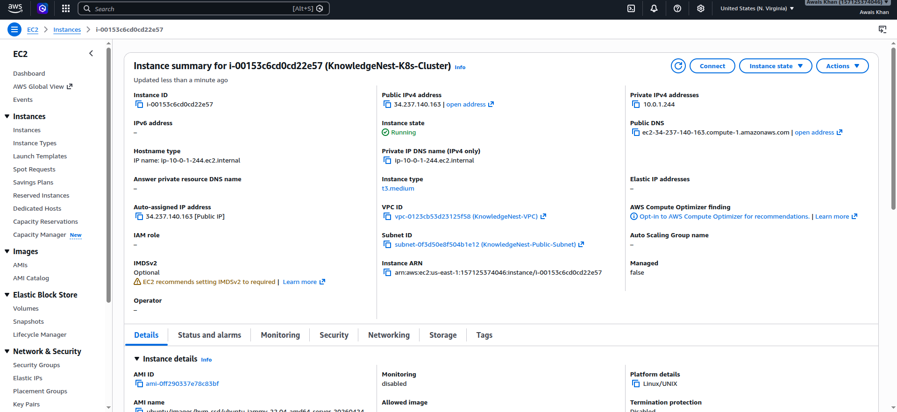
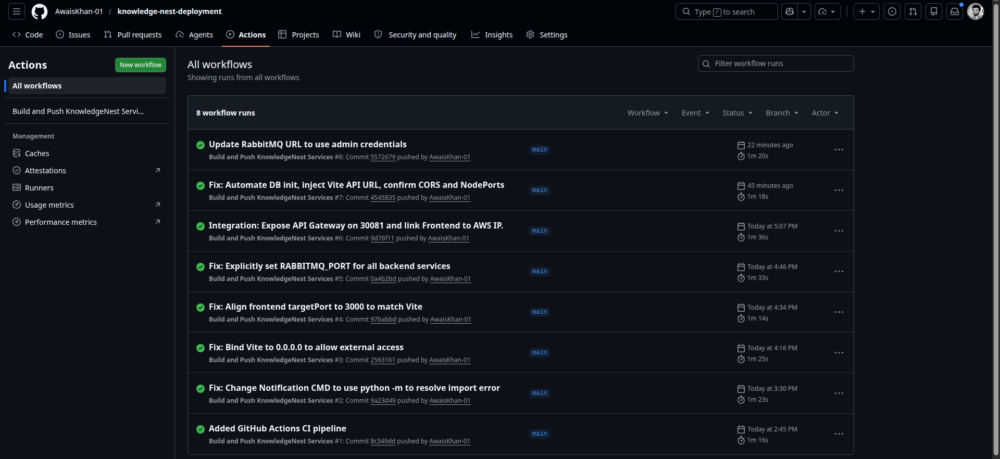
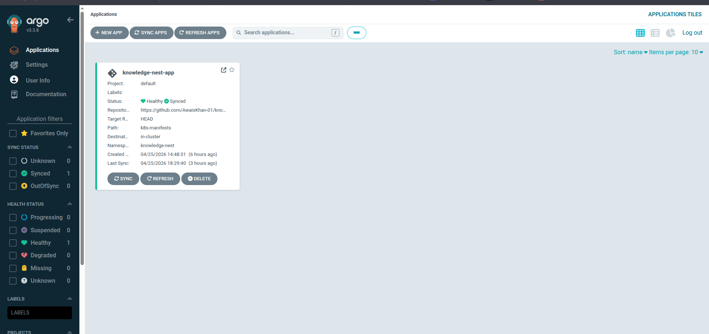
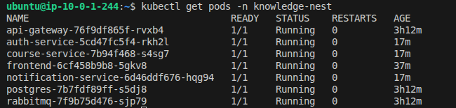
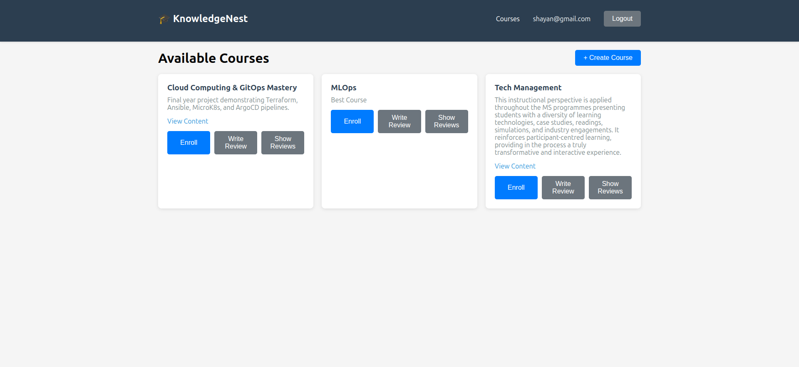

# KnowledgeNest: Automated Multi-Tier Application Deployment

**A Cloud-Native Microservices Ecosystem**

## Project Team
* **Muhammad Awais Khan**
* **Abdullah**

---

## Table of Contents
1. [Executive Summary](#executive-summary)
2. [Architecture & Technology Stack](#architecture--technology-stack)
3. [Prerequisites](#prerequisites)
4. [Deployment Lifecycle](#deployment-lifecycle)
5. [Configuration & Self-Healing Mechanics](#configuration--self-healing-mechanics)
6. [Challenges & Engineering Solutions](#challenges--engineering-solutions)
7. [System Verification](#system-verification)

---

## Executive Summary
This project demonstrates the end-to-end automation and deployment of a multi-tier microservices application named **KnowledgeNest**. Transitioning away from manual configurations, this architecture implements **Infrastructure as Code (IaC)**, automated **Configuration Management**, and a robust **GitOps CI/CD pipeline**. The result is a highly available, self-healing environment hosted on Amazon Web Services (AWS) and orchestrated via Kubernetes.

---

## Architecture & Technology Stack

The KnowledgeNest application is a distributed system comprising a React frontend, an API Gateway, and multiple Python/Flask backend services communicating asynchronously via RabbitMQ, with state persisted in PostgreSQL.

* **Cloud Provider:** Amazon Web Services (AWS EC2)
* **Infrastructure as Code:** HashiCorp Terraform
* **Configuration Management:** Ansible
* **Container Orchestration:** MicroK8s (Kubernetes)
* **CI/CD Pipeline:** GitHub Actions & ArgoCD
* **Backend Stack:** Python (Flask, SQLAlchemy)
* **Message Broker:** RabbitMQ
* **Database:** PostgreSQL
* **Frontend:** React (Vite)

### AWS Infrastructure Overview
* **Compute:** 1x `t3.medium` EC2 Instance (Ubuntu 22.04 LTS) to support the memory footprint of a full Kubernetes cluster.
* **Networking:** Custom Security Group exposing ports `22` (SSH), `80/443` (HTTP/S), `30080` (React Frontend), and `30081` (API Gateway).



---

## Prerequisites
To reproduce this environment, the following tools must be installed locally:
* [Terraform](https://www.terraform.io/downloads.html) (v1.0+)
* [Ansible](https://docs.ansible.com/ansible/latest/installation_guide/intro_installation.html)
* [AWS CLI](https://aws.amazon.com/cli/) (Configured with IAM credentials)
* Git

---

## Deployment Lifecycle

The deployment process is divided into four automated phases:

### Phase 1: Infrastructure Provisioning (Terraform)
Utilized Terraform to declaratively build the AWS infrastructure.
```bash
cd terraform-aws
terraform init
terraform plan
terraform apply -auto-approve
```

### Phase 2: Cluster Bootstrap (Ansible)
Once the EC2 instance is provisioned, Ansible connects via SSH to configure the host and initialize the MicroK8s cluster.
```bash
cd ansible-config
ansible-playbook -i hosts.ini setup-cluster.yml
```
*Key Ansible Tasks:* Installing MicroK8s, enabling DNS, Storage, and Registry add-ons, and configuring user group permissions.

### Phase 3: Continuous Integration (GitHub Actions)
Our monorepo utilizes GitHub Actions to automatically build and containerize the microservices upon pushing to the `main` branch. 
* **Dynamic Frontend Injection:** The Vite React application requires the API URL at build-time. The pipeline injects `--build-arg VITE_API_BASE_URL=http://44.205.8.150:30081` during the Docker build process, ensuring the frontend container is permanently "baked" with the correct production gateway address.



### Phase 4: Continuous Deployment (ArgoCD GitOps)
ArgoCD is deployed within the Kubernetes cluster and continuously monitors the `/k8s-manifests/` directory in our GitHub repository.
* **Synchronization:** Any updates to the YAML manifests or new Docker image tags trigger an immediate, automated rollout to the `knowledge-nest` namespace, maintaining the cluster's desired state without manual intervention.



---

## Configuration & Self-Healing Mechanics

To achieve true automation, several application-level configurations were engineered to prevent crash loops:

### 1. Automated Database Schema Generation
**Mechanism:** Python SQLAlchemy

When the backend pods (Auth, Course, Review, Notification) spin up, the PostgreSQL database is initially empty. We implemented automated table initialization by injecting `Base.metadata.create_all(bind=engine)` into the startup sequence of every `app.py`. The services now automatically detect missing schemas and self-provision their tables upon booting.

### 2. Secure Message Broker Networking
**Mechanism:** RabbitMQ Access Control

The default `guest` user in RabbitMQ rejects connections from external pods, causing severe network timeouts. We bypassed this by executing a secure configuration within the cluster to create an `admin` user with full cross-network permissions.
```bash
kubectl exec -n knowledge-nest $(kubectl get pods -n knowledge-nest -l app=rabbitmq -o jsonpath='{.items[0].metadata.name}') -- rabbitmqctl add_user admin admin
kubectl exec -n knowledge-nest $(kubectl get pods -n knowledge-nest -l app=rabbitmq -o jsonpath='{.items[0].metadata.name}') -- rabbitmqctl set_permissions -p / admin ".*" ".*" ".*"
kubectl exec -n knowledge-nest $(kubectl get pods -n knowledge-nest -l app=rabbitmq -o jsonpath='{.items[0].metadata.name}') -- rabbitmqctl set_user_tags admin administrator
```

---

## Challenges & Engineering Solutions

| Challenge Encountered | Root Cause | Implemented Solution |
| :--- | :--- | :--- |
| **Frontend 500 Internal Server Error** | Vite configuration was routing API calls to `localhost` inside the browser instead of the AWS Gateway. | Modified `Dockerfile` and GitHub Actions CI to pass `ARG VITE_API_BASE_URL` into the build context. |
| **Backend 500 Internal Server Error** | Pods were successfully running, but database tables (`users`, `courses`) did not exist. | Engineered the Flask apps to execute SQLAlchemy `create_all()` triggers prior to starting the web server. |
| **Severe UI Latency (10s+ Timeouts)** | Services were trapped in a retry loop due to RabbitMQ refusing the default `guest` credentials over the network. | Created a dedicated `admin` network user for RabbitMQ and updated the Kubernetes `02-services.yaml` to inject the new credentials. |

---

## System Verification

The infrastructure and application logic are fully operational. All microservices are communicating via the API Gateway and RabbitMQ.

**Terminal Verification:**



**Application Verification:**
The KnowledgeNest application is live and accessible.
* **URL:** `http://44.205.8.150:30080`



---
*Project documentation finalized by Muhammad Awais Khan & Abdullah.*
